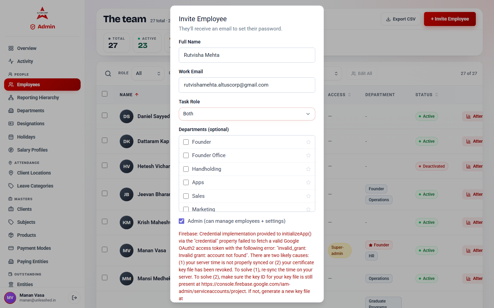
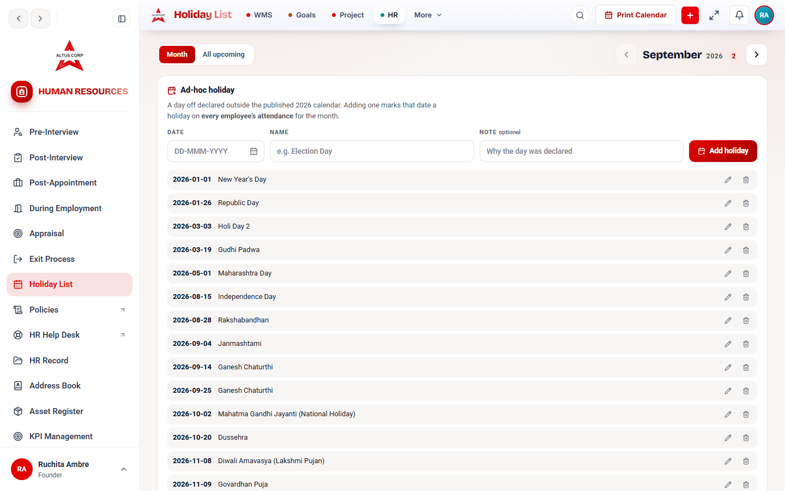
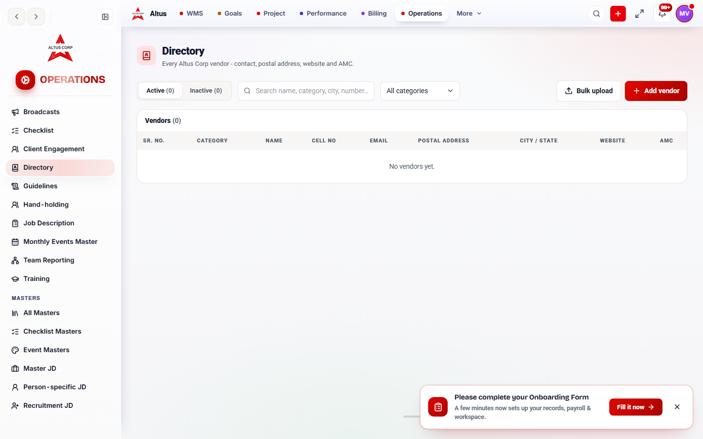
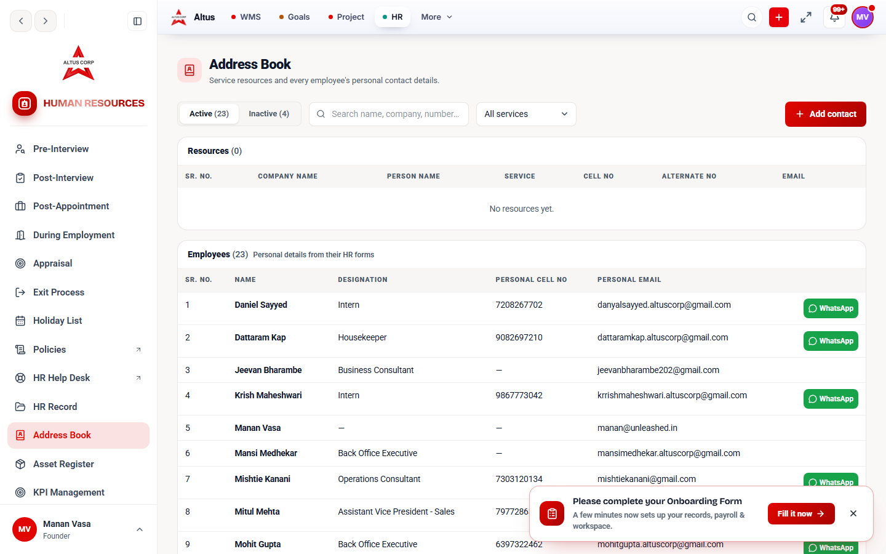
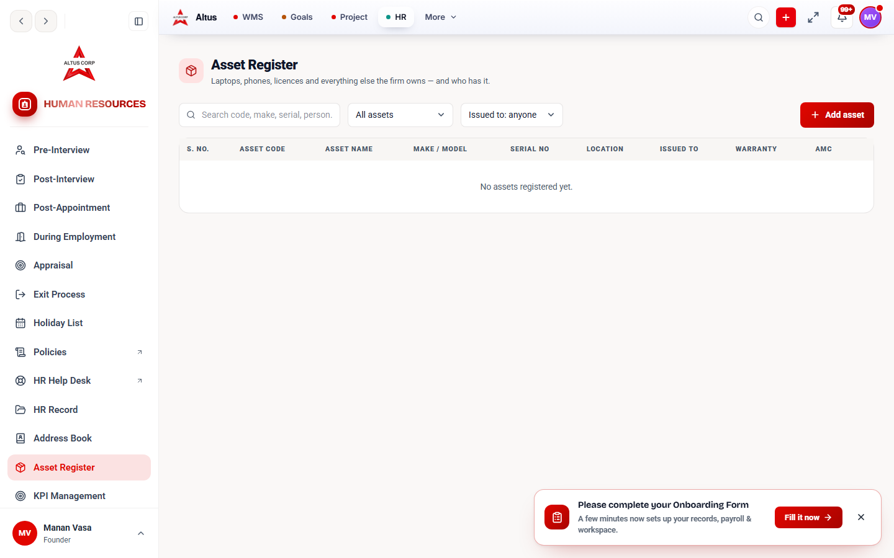
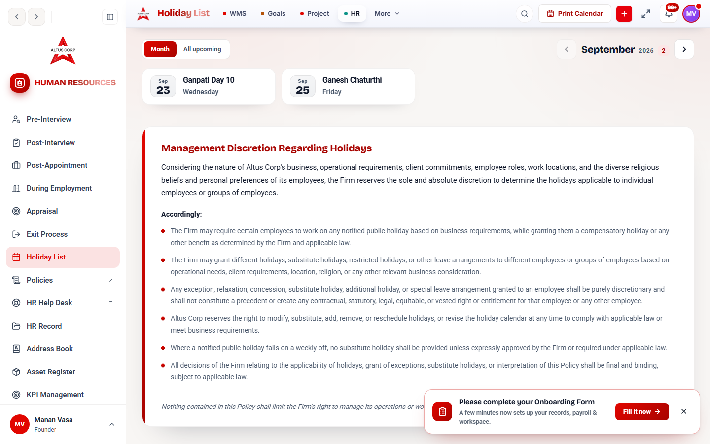
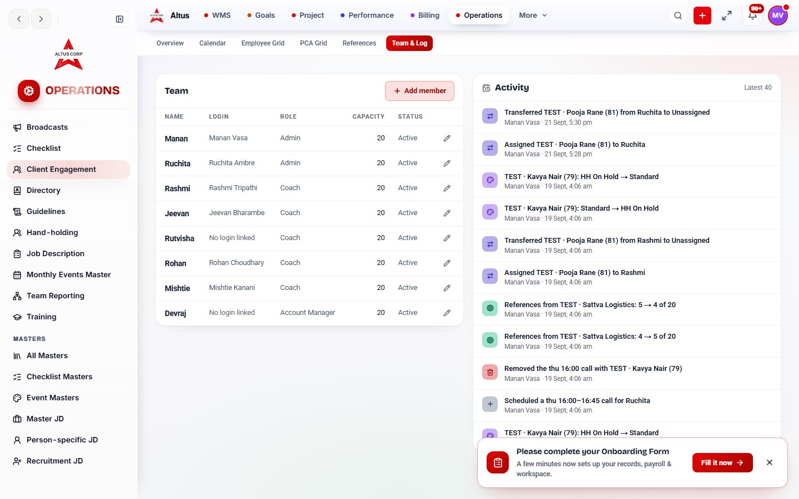
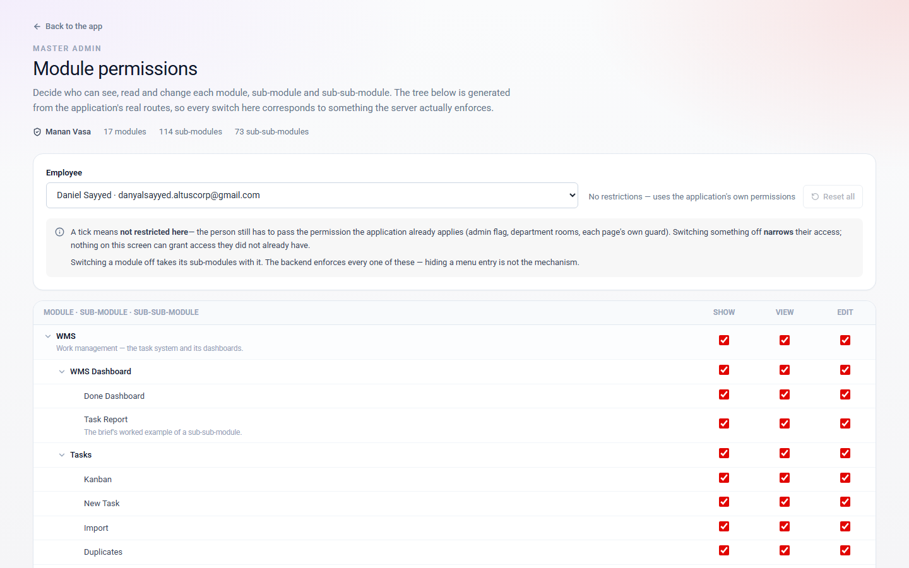

# HR Exclusive Test

**Written for:** Manan, Ruchita and Rutvisha, plus whoever maintains the permission code.

Tested 21 September 2026 against `localhost:3000`, which is the **live Supabase project** — every write below was a real write to production, made under a `TEST-HREX` name and deleted in the same run. Signed in as **Manan Vasa** (`manan@unleashed.in`) via `DEV_USER_EMAIL`, confirmed from the rail's user card on every run.

---

## Read this first: three findings that change what the rest means

### 1. Rutvisha Mehta has no account at all

`rutvishamehta.altuscorp@gmail.com` appears in **six** permission allow-lists in the code. There is no `employees` row with that address, and none with her name. The Admin Panel lists 27 people; she is not among them.

Every grant made to her today reaches nobody:

| Grant | Where |
|---|---|
| `device.manage` | `lib/security/capabilities.ts` |
| `attendance.manage_others` | `lib/security/capabilities.ts` |
| `attendance.view_audit_log` | `lib/security/capabilities.ts` |
| `HOLIDAY_ADMIN_EMAILS` | `lib/hr/holiday-admins.ts` |
| `HR_REGISTER_EDITOR_EMAILS` | `lib/hr/registers.ts` (Address Book, Asset Register, **and** the Operations Directory) |
| `CLIENT_LOCATION_EDITOR_EMAILS` | `lib/auth/attendance-permissions.ts` |
| `REMOTE_WORK_APPROVER_EMAILS` | `lib/auth/attendance-permissions.ts` |

The holiday calendar is the sharp end: `HOLIDAY_ADMIN_EMAILS` is **Ruchita and Rutvisha only**. With Rutvisha absent, exactly one person in the company can change the holiday calendar.

### 2. A wrong `DEV_USER_EMAIL` silently signs you in as Manan

`lib/auth/local-session.ts:61` — when `DEV_USER_EMAIL` matches no employee it logs a warning to the server console and **falls back to the first active admin ordered by name**. That is Manan Vasa.

`.env.local` has held `DEV_USER_EMAIL="rutvishamehta.altuscorp@gmail.com"` since 2026-09-17. So every local session that believed it was Rutvisha has in fact been Manan, with Manan's powers, for four days. Nothing in the browser says so — only a line in the terminal.

This invalidates any earlier "tested as Rutvisha" result, including one of my own from this session before I noticed.

**Suggested fix, in the code rather than the env** — make the fallback refuse instead of guessing. A dev session that cannot be the person it names should fail loudly, not silently become the most powerful account in the system.

### 3. The Firebase service-account key is dead — nobody can be invited

Inviting Rutvisha through the Admin Panel failed at the first step:

> Firebase: Credential implementation provided to initializeApp() via the "credential" property failed to fetch a valid Google OAuth2 access token with the following error: **"invalid_grant: Invalid grant: account not found"**.

`FIREBASE_CLIENT_EMAIL=firebase-adminsdk-fbsvc@altuscorp-e7140.iam.gserviceaccount.com` no longer resolves — the service account or its key has been deleted or revoked. "account not found" points at the account, not at clock skew.

**Nothing was created.** The employee total is unchanged at 27 total · 23 active · 1 pending invite, and there is no orphan row: the Firebase user is created before the employee row, so the failure happened before any write.

Until a new service-account key is generated at the Firebase console, **no new employee can be added to the WMS from this machine** — this is not specific to Rutvisha.



---

## The inventory: what is restricted, and to whom

There is no single registry. The rules live in a capability table plus eight separate allow-lists, so this list was assembled by sweeping `lib/**` for every `_EMAILS` constant and every `hasCapability` call site.

Rows 1–6 are the strict **"only Ruchita, Rutvisha and Manan"** set the brief asks about. The rest are listed because the differences are the interesting part — several lists that read like "the trio" are not.

| # | Feature | Guard | Who holds it |
|---|---|---|---|
| 1 | Operations → **Directory** (add/edit/delete/bulk) | `canEditOpsDirectory` → `canEditHrRegisters` | Ruchita, Rutvisha, Manan |
| 2 | HR → **Address Book of Resources** (write) | `canEditHrRegisters` | same three |
| 3 | HR → **Asset Register** (write) | `canEditHrRegisters` | same three |
| 4 | Attendance → **Client locations** (write) | `CLIENT_LOCATION_EDITOR_EMAILS` | same three |
| 5 | **Edit another employee's attendance** past the lock | `attendance.manage_others` | same three |
| 6 | **Attendance change log** | `attendance.view_audit_log` | same three |
| 7 | Attendance admin (devices, office-IP allowlist, settings) | `ATTENDANCE_ADMIN_EMAILS` | the three **+ Om** |
| 8 | **Device** approve / register / revoke | `device.manage` | the three **+ Rohan** |
| 9 | **Remote-work** decisions | `REMOTE_WORK_APPROVER_EMAILS` | Rutvisha, Manan, Om — **not Ruchita** |
| 10 | HR → **Holiday calendar** | `canManageHolidays` | Ruchita, Rutvisha — **not Manan** |
| 11 | **Publish policies** | `canPublishPolicies` | Manan, Ruchita |
| 12 | Client Engagement — assign, transfer, roster | `canManageCe` | Manan, Ruchita |
| 13 | Hand-holding — delete a participant | `PARTICIPANT_DELETERS` | Manan, Ruchita |
| 14 | Hand-holding — Admin Panel | `ADMIN_PANEL_EMAILS` | Manan only |
| 15 | Index Hub — delete | `INDEX_HUB_DELETE_EMAILS` | Manan only |
| 16 | Master Admin — the permission matrix | `master_admin.manage` | Manan, Rohan |
| 17 | Subject / Client dropdowns | `task_rosters.manage` | Manan, Jeevan, Rohan |
| 18 | DCC — edit past entries, protected KPIs | `dcc.edit_past_entries`, `dcc.protected_kpi_author` | Manan only |
| 19 | Reverse a task sign-off | `lib/tasks/approval-permissions.ts` | Manan only |
| 20 | Exempt from the daily-start gates | `daily_start.exempt` | Manan only |
| 21 | Grant delegated access to anyone | `delegated_access.grant_any` | Manan, Rohan |

**Worth noticing about #12.** `canManageCe` matches on the email list *or* on **first name** — `MANAGERS_BY_NAME = ["manan", "ruchita"]` (`lib/client-engagement/access.ts:38`). Any future employee whose first name is Manan or Ruchita acquires the power to assign and transfer every client account, without appearing in any allow-list. It is the one guard here that can be inherited by accident.

---

## Results

`PASS` = behaved as the code says it should for Manan. Note row 10 is a **correct refusal** — it passes by being refused.

| # | Test | Method | Verdict |
|---|---|---|---|
| 1 | Directory — write controls offered | surface | **PASS** |
| 1 | Directory — create a vendor | **real write** | **PASS** |
| 1 | Directory — delete it again | **real write** | **PASS** |
| 2 | Address Book — write controls offered | surface | **PASS** |
| 2 | Address Book — create a contact | **real write** | **PASS** |
| 2 | Address Book — delete it again | **real write** | **PASS** |
| 3 | Asset Register — write controls offered | surface | **PASS** |
| 3 | Asset Register — create an asset | **real write** | **PASS** |
| 3 | Asset Register — delete it again | **real write** | **PASS** |
| 10 | Holiday calendar — Manan **refused** | surface + guard trace | **PASS (refused, as designed)** |
| 12 | Client Engagement — manage the team | surface | **PASS** |
| 14 | Hand-holding — Admin Panel | surface | **PASS** |
| 16 | Master Admin — permission matrix | surface | **PASS** |
| 4 | Attendance — client locations | surface | **PASS** |
| 17 | Admin Panel — Subjects roster | surface | **PASS** |
| 15 | Index Hub | surface | **PASS** |

**"Surface" means what it says.** The route opened and the privileged control rendered. Hiding a control is presentation, not authorization, so each surface result is paired above with the server guard that actually decides it. Rows 8, 11 and 16 were deliberately **not** exercised as writes — revoking a device, publishing a policy and rewriting the permission matrix are destructive or irreversible on live data, and a test that cannot be undone is not a test worth running on production.

### The control that makes the surface results mean something

A surface check has an obvious hole: an absent control proves nothing on its own, because it could be absent for an unrelated reason — a broken page, a failed query, a typo in a route. "Nothing rendered" and "you were refused" look identical from outside.

So each surface result was re-run as **Ruchita Ambre**, who exists and holds a *different* set of grants. Same pages, same code, same machine, one variable changed. If the gates are real, the two sessions must disagree in exactly the places the allow-lists say they should:

| Surface | Held by | Manan | Ruchita | Discriminates? |
|---|---|---|---|---|
| HR → Holiday calendar | Ruchita, Rutvisha | **no panel** | **full panel + Add holiday + edit/delete on all 14 holidays** | **yes** |
| Hand-holding → Admin Panel | Manan only | reachable | **refused** | **yes** |
| Master Admin → permission matrix | Manan, Rohan | reachable | **403 "Admin only"** | **yes** |
| Operations → Directory | the trio | Add vendor | Add vendor | agree, correctly |
| HR → Asset Register | the trio | Add asset | Add asset | agree, correctly |

Three clean disagreements, each in the direction the code predicts, and two agreements where both hold the grant. The gates discriminate; they are not simply open to every admin.

Both sessions were verified as genuinely resolved — zero `[local-session]` fallback warnings in the server log, and the rail's user card read "Manan Vasa" and "Ruchita Ambre" respectively. Given finding 2, that check is not optional.



### What is still NOT proven

Stated plainly, because the gap is real:

- **No holiday write was attempted as Manan and refused by the server.** There is no control to click, and a Next server action cannot practically be POSTed by hand. The refusal rests on the page gate (`page.tsx:137`) plus a read of all three write actions (`addAdHocHoliday`, `editAdHocHoliday`, `removeAdHocHoliday`), each of which re-checks `canManageHolidays(me.email)` server-side before touching the database. Strong, but it is a code trace, not an executed refusal.
- **Rows 4-9 and 11-21 were never write-tested at all** — only rows 1, 2 and 3 were, and those are the only ones marked as real writes above.
- **Nobody outside the allow-lists was tested.** An ordinary employee with no grants was never put through these pages, so "everyone else is refused" is asserted from the code, not observed.

### 1 · Operations → Directory

Created `TEST-HREX-Vendor`, confirmed it in the table, deleted it. Directory is back to 0 vendors.



### 2 · HR → Address Book of Resources

Created `TEST-HREX-Contact`, confirmed, deleted.



### 3 · HR → Asset Register

Created `TEST-HREX-Asset` and the server issued asset code **OTH-0001** — proof the row was written rather than echoed back by the form. Then deleted.



### 10 · HR → Holiday calendar — correctly refused

As Manan the page's complete button list is `["More", "Print Calendar", "MV"]` — no ad-hoc holiday panel and no add control of any kind. As Ruchita the same page reads `["More", "Print Calendar", "RA", "Add holiday"]` and renders the full panel.

`app/(app)/hr/holidays/page.tsx:137` gates the panel on `canManageHolidays(me.email)`, and all three write actions re-check the same predicate server-side before writing. See the control table above for why the absence is meaningful rather than incidental.



### 12, 14, 16 and the rest




---

## What to do next

1. **Generate a new Firebase service-account key** for `altuscorp-e7140` and update `FIREBASE_CLIENT_EMAIL` / `FIREBASE_PRIVATE_KEY`. Nobody can be invited until this is done.
2. **Then create Rutvisha** — Admin Panel → Invite Employee, name `Rutvisha Mehta`, email `rutvishamehta.altuscorp@gmail.com`, Task Role `Both`, Admin checked. Her seven code-level grants switch on by themselves, because they are keyed by that address.
3. **Decide about the holiday calendar.** Until she exists, Ruchita alone can change it, and Manan cannot. If that is not the intent, the fix is one line in `lib/hr/holiday-admins.ts`.
4. **Fix the silent dev-login fallback** in `lib/auth/local-session.ts` so a `DEV_USER_EMAIL` that matches nobody refuses rather than becoming Manan.
5. **Consider dropping `MANAGERS_BY_NAME`** from `lib/client-engagement/access.ts` — matching on first name means a future hire can inherit client-assignment rights by being called Manan or Ruchita.

## How to re-run

```
# 1. become the person under test
#    .env.local → DEV_USER_EMAIL="manan@unleashed.in"
# 2. restart :3000, then CHECK THE TERMINAL for
#    "[local-session] ... matched no employee" — if it appears, you are Manan,
#    whoever you meant to be.
# 3. the scripted runs (each creates and deletes its own TEST-HREX record)
node scripts/look.mjs --live /operations/directory
```

The driver scripts are in this session's scratchpad, not committed — they are one-off harnesses, not a suite. What is committed is this report and its screenshots.

**`.env.local` was restored to exactly its original contents** after testing, byte for byte, including `RESEND_API_KEY` (muted during the invite attempt so no credentials email could leave the machine) and `DEV_USER_EMAIL` (still the Rutvisha address — see finding 2).
